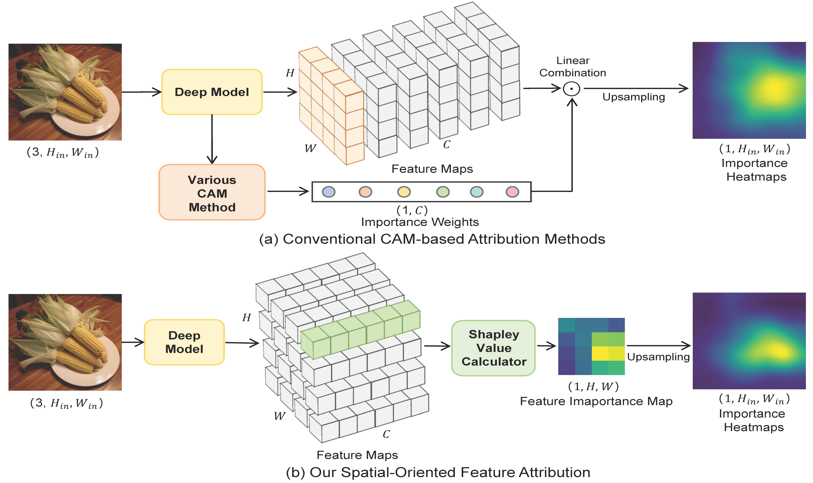

# ReadMe

## Project Overview

This repository contains the code for the paper titled "Towards Boosting Out-of-Distribution Detection from a Spatial Feature Importance Perspective", which has been accepted by **IJCV2025**. The document provides examples on how to use the interpretability methods discussed in the paper, demonstrates the ROAD faithfulness evaluation method, and showcases our Out-of-Distribution (OOD) detection approach based on spatial feature purification.

## Setup Instructions

### Models

Please create a new folder named `shared_models` in the current directory. You will need to download the models used in our experiments from the following link:

- **Link**: [Baidu Netdisk](https://pan.baidu.com/s/1MuhqIU6hX5JURTE653fpEw)
- **Extraction Code**: mode

### Datasets

Given the large size of the datasets, we have compressed them into multiple parts. Follow these steps to prepare the datasets:

1. Create a new directory named `datasets`.
2. Download all compressed parts from the link provided below:
   - **Link**: [Baidu Netdisk](https://pan.baidu.com/s/1NtgjQlkBYfgOf0MIrdzRYw)
   - **Extraction Code**: mode
3. After downloading all parts, run the following command in your terminal to merge and extract the datasets:

```
cat datasets.tar.gz* > datasets.tar.gz
tar -xzf datasets.tar.gz -C ./datasets
```
As shown in the figure below, (a) represents the conventional Channel-Based Feature Attribution Method; (b) represents the Spatial-Oriented Feature Attribution Method proposed in this paper. This method can effectively help researchers eliminate unimportant content from dense features, thereby improving the performance of downstream tasks based on dense features.



### SOFA

The SOFA folder contains examples of the Spatial-Oriented Feature Attribution Method. We provide two Jupyter Notebook files. You can run the corresponding files to observe the importance of features. We also include code for evaluating faithfulness and for plotting line charts within these files.

### SFP


### Citation
```
@article{zhu2025towards,
  title={Towards Boosting Out-of-Distribution Detection from a Spatial Feature Importance Perspective},
  author={Zhu, Yao and Yan, Xiu and Xie, Chuanlong},
  journal={International Journal of Computer Vision},
  pages={1--19},
  year={2025},
  publisher={Springer}
}
```

### Contact
For any questions or further assistance, please contact me at ee_zhuy@zju.edu.cn.
Thank you for your interest in our work!
